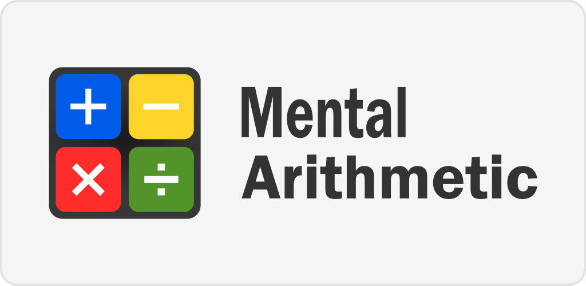

# Brain Games - math games for score development

Сollection of programs for the development of mental arithmetic:



### List of games in the collection

1. **brain-even**
    *rules: whot number "even" or "not even" ?*

2. **brain-calc**
    *rules: count (arithmetic operations)*

3. **brain-gcd**
    *rules: finding a common divisor* 

4. **brain-prime**
    *rules: whot numbe "prime" or "not prime" ?*

5. **brain-progression**
    *rules: search for the dropped number from the progression* 

### Installation:

> [!NOTE]
> [poetry](https://python-poetry.org/docs/) is required to be installed to run

```git clone git@github.com:volond121/python-project-49.git```
```make build```
```make package-install```


### Hexlet tests and linter status:
[](https://github.com/volond121/python-project-49/actions)

[](https://api.codeclimate.com/v1/badges/e65e05d2484a6468ccad/maintainability)

### Demonstration

- [Recording "brain-games" on asciinema.org](https://asciinema.org/a/lEjUn4YagEG4hj42EJ4THQjqZ)

- [Recording "brain-calc" on asciinema.org](https://asciinema.org/a/OQW9AqUJar3wYWq0E17M6j4gC)

- [Recording "brain-gcd" on asciinema.org](https://asciinema.org/a/okzIh1mcFk1z8b7EmklMEW5x9)

- [Recording "brain-progression" on asciinema.org](https://asciinema.org/a/ficot3V4GNhgaGZ3paV41dqek)

- [Recording "brain-prime" on asciinema.org](https://asciinema.org/a/gKJNlpLA0DFCM5bE4SZVtJNVc)

- [Recording "brain-even" on asciinema.org](https://asciinema.org/a/XB3kQ3NdgxRQnIkmJjPMbGCyb)
